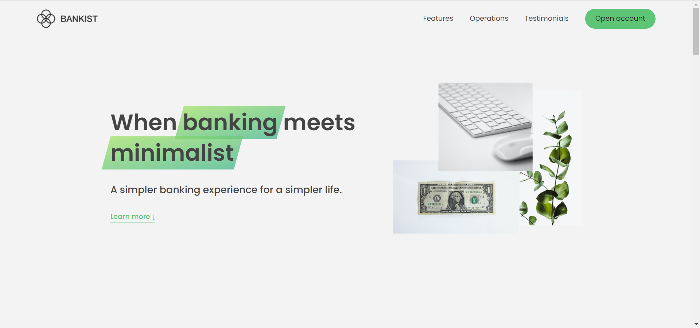
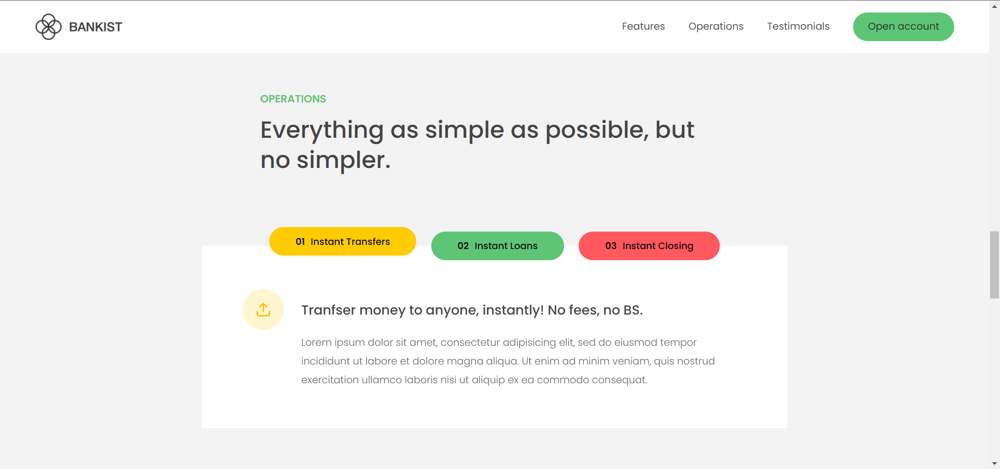
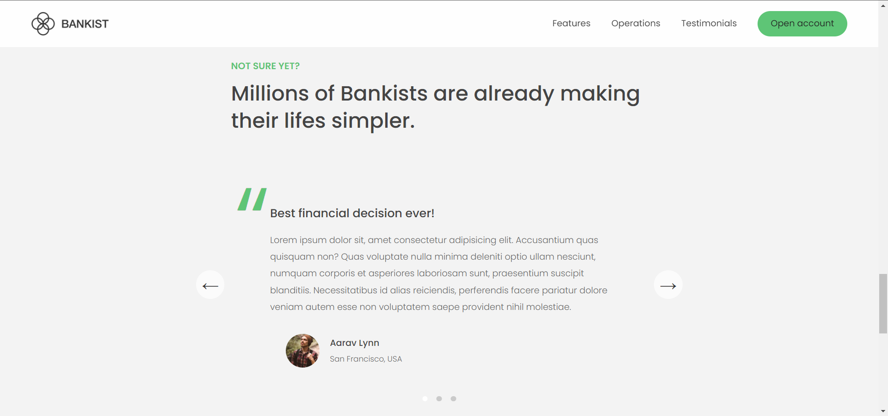

# Banking-Website
This is a responsive sample website I created to help reinforce my JavaScript abilities.

Features Include:  
- Lazy loaded images (or better performance)  
- Display tabs  
- Content slide bar  

Check it out here: https://mictran8500.github.io/Banking-Website/

  
  
  

This is a project from Jonas Schemdtmann's "The Complete JavaScript Course 2022: From Zero to Expert!" course.
